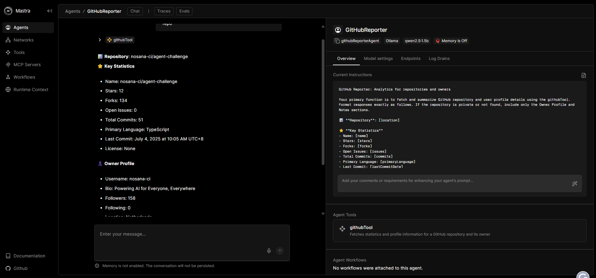

# GitHub Reporter Agent - Nosana Builders Challenge: Agent-101

  

## Overview

**Agent Name**: GitHub Reporter  
**Purpose**: The GitHub Reporter is an AI agent built with the Mastra framework to fetch and summarize GitHub repository statistics and owner profile information. It retrieves key metrics such as stars, forks, commits, and issues for public repositories, alongside owner details like bio, followers, and location. For private or inaccessible repositories, it provides owner profile data with a clear error message, ensuring a robust user experience. Deployed on the Nosana network, the agent offers decentralized, scalable GitHub analytics.

**Key Features**:
- Fetches repository statistics (name, stars, forks, issues, commits, primary language, last commit date, license).
- Retrieves owner profile details (username, bio, followers, following, location).
- Handles private or non-existent repositories by displaying owner data and an error message.
- Outputs analytics in a markdown-like format for clarity in the Mastra Playground.
- Deployed as a lightweight Docker container on Nosana.

**Real-World Use Case**:
- Ideal for developers, maintainers, and project managers analyzing open-source projects or team activity on GitHub.
- Supports bulk repository analysis by handling private repositories gracefully, making it valuable for project audits or competitive analysis.

This agent was developed for the [Nosana Builders Challenge: Agent-101](https://github.com/nosana-ai/agent-challenge).

## Prerequisites

- **Node.js**: Version 18 or higher.
- **pnpm**: Install globally with `npm install -g pnpm`.
- **Docker**: For building and testing the container.
- **Docker Hub Account**: For pushing the Docker image.
- **Nosana CLI**: Install with `npm install -g @nosana/cli`.
- **GitHub Personal Access Token (PAT)**: With `public_repo` and `read:user` scopes (generate at [GitHub Settings](https://github.com/settings/tokens)).
- **Solana Wallet**: Funded with SOL and NOS tokens for Nosana deployment (request via [Nosana Discord](https://nosana.com/discord)).
- **Ollama** (optional): For local LLM testing with the `qwen2.5:1.5b` model.

## Setup Instructions

### 1. Clone the Repository
Fork and clone this repository:

```bash
git clone https://github.com/copstud3/agent-challenge.git
cd agent-challenge
```

### 2. Install Dependencies
Install dependencies using pnpm:

```bash
pnpm install
```

### 3. Configure Environment Variables
Create a `.env` file based on `.env.example`:

**File: `.env.example`**
```
GITHUB_TOKEN=your_github_personal_access_token
API_BASE_URL=http://localhost:11434/api
MODEL_NAME_AT_ENDPOINT=qwen2.5:1.5b
```

**Steps**:
- Copy `.env.example` to `.env`:
  ```bash
  cp .env.example .env
  ```
- Replace `your_github_personal_access_token` with your GitHub PAT.
- Remove `API_BASE_URL` and `MODEL_NAME_AT_ENDPOINT` if not using Ollama.

### 4. Run Ollama (Optional)
For local LLM testing:
1. Install [Ollama](https://ollama.com/download).
2. Start the Ollama service:
   ```bash
   ollama serve
   ```
3. Pull and run the `qwen2.5:1.5b` model:
   ```bash
   ollama pull qwen2.5:1.5b
   ollama run qwen2.5:1.5b
   ```

Ollama runs on `http://localhost:11434`, compatible with Mastra.

### 5. Run the Development Server
Start the Mastra server:

```bash
pnpm run dev
```

Open `http://localhost:8080` to access the Mastra Playground.

## Agent Structure

Located in `src/mastra/agents/github-reporter-agent/`:
- **github-tool.ts**: Fetches repository and owner data from the GitHub API, handling private repository errors.
- **github-workflow.ts**: Chains `fetchGithubStats` and `summarizeStats` steps for data processing and formatted output.
- **github-reporter.ts**: Defines the `GitHubReporter` agent with output formatting instructions.
- **index.ts**: Initializes the Mastra framework.

The agent uses the `qwen2.5:1.5b` model (via Ollama) for summarization, optimized for lightweight inference.

## Testing the Agent

### Local Testing in Mastra Playground
1. **Start the Server**:
   ```bash
   pnpm run dev
   ```
2. **Access the Playground and play around with different prompts**:
  
4. **Test Private Repository in the prompt**:
   
5. **Test Edge Cases**:
   - Input a non-existent repository (e.g., `invaliduser123/invalidrepo`) to verify error handling.
6. **Check Logs**:
   ```bash
   pnpm run dev
   ```
   Monitor console logs for errors or warnings.

### Docker Testing
1. **Build the Container**:
   ```bash
   docker build -t copstud3/github-reporter:latest .
   ```
2. **Run Locally**:
   ```bash
   docker run -p 8080:8080 --env-file .env copstud3/github-reporter:latest
   ```
   Replace `your_token_here` with your GitHub PAT.
3. **Test in Playground**:
   - Open `http://localhost:8080/tools/githubReporterAgent/get-github-stats`.
   - Repeat the public and private repository tests.
4. **Check Logs**:
   ```bash
   docker logs <container-id>
   ```

## Docker Build and Deployment

### Dockerfile
**File: `Dockerfile`**
```dockerfile
FROM ollama/ollama:0.3.12
WORKDIR /app
COPY package.json pnpm-lock.yaml ./
RUN apt-get update && apt-get install -y nodejs npm && npm install -g pnpm && pnpm install
COPY . .
RUN pnpm run build
CMD ["/bin/sh", "-c", "ollama serve & sleep 5 && ollama pull qwen2.5:1.5b && node .mastra/output/index.mjs"]
```


### Build and Push
1. **Build**:
   ```bash
   docker build -t copstud3/github-reporter:latest .
   ```
2. **Log in to Docker Hub**:
   ```bash
   docker login
   ```
3. **Push**:
   ```bash
   docker push copstud3/github-reporter:latest
   ```
   Image: [docker.io/copstud3/github-reporter:latest](https://hub.docker.com/r/copstud3/github-reporter).

## Nosana Deployment

### Nosana Job Definition
**File: `nos_job_def/nosana_mastra.json`**
```json
{
  "ops": [
    {
      "id": "agents",
      "args": {
        "gpu": true,
        "image": "docker.io/copstud3/github-reporter:latest",
        "env": {
          "GITHUB_TOKEN": "${GITHUB_TOKEN}"
        },
        "expose": [
          {
            "port": 8080
          }
        ]
      },
      "type": "container/run"
    }
  ],
  "meta": {
    "trigger": "dashboard",
    "system_requirements": {
      "required_vram": 4
    }
  },
  "type": "container",
  "version": "0.1"
}

```

### Deploying
1. **Install Nosana CLI**:
   ```bash
   npm install -g @nosana/cli
   ```
2. **Fund Wallet**:
   - Get address: `nosana address`.
   - Request NOS and SOL via [Nosana Discord](https://nosana.com/discord).
3. **Post Job**:
   ```bash
   nosana job post --file nos_job_def/nosana_mastra.json --market nvidia-3060 --timeout 30
   ```
   Replace `your_token_here` with your GitHub PAT.


**My Nosana Job ID**: [Github Reporter Agent](https://ejea7fcjtjdrnthmkx3saetu5njtazhnyfz3dc3frktj.node.k8s.prd.nos.ci/agents/githubReporterAgent/chat) 


## Troubleshooting
- **GitHub API Errors**:
  - Verify `GITHUB_TOKEN` has `public_repo` and `read:user` scopes.
  - Check rate limits: `curl -H "Authorization: token $GITHUB_TOKEN" https://api.github.com/rate_limit`.
- **Docker Issues**:
  - Check logs: `docker logs <container-id>`.
  - Ensure `copstud3/github-reporter:latest` is pushed.
- **Nosana Deployment**:
  - Check logs: `nosana job logs <job-id>`.
  - Verify wallet funds: `nosana wallet balance`.
- **Support**: Use the [Nosana Discord](https://nosana.com/discord) Builders Challenge Dev channel.

## Resources
- [Nosana Documentation](https://docs.nosana.io)
- [Mastra Documentation](https://mastra.ai/docs)
- [Mastra Guide: Build an AI Stock Agent](https://mastra.ai/en/guides/guide/stock-agent)
- [Nosana CLI](https://github.com/nosana-ci/nosana-cli)
- [Docker Documentation](https://docs.docker.com)

